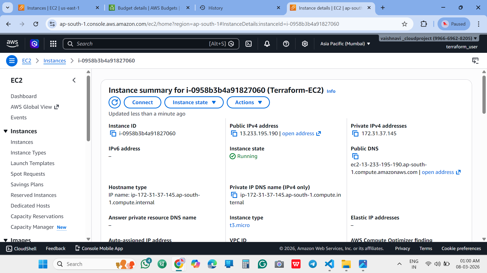
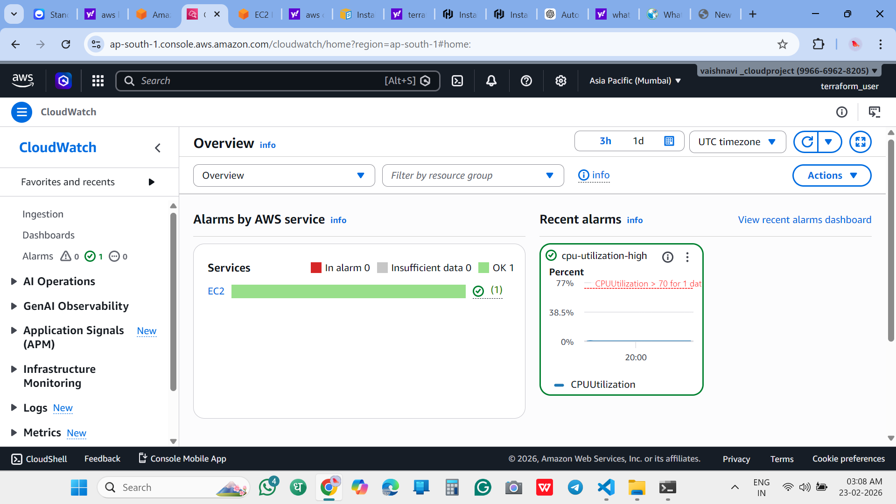
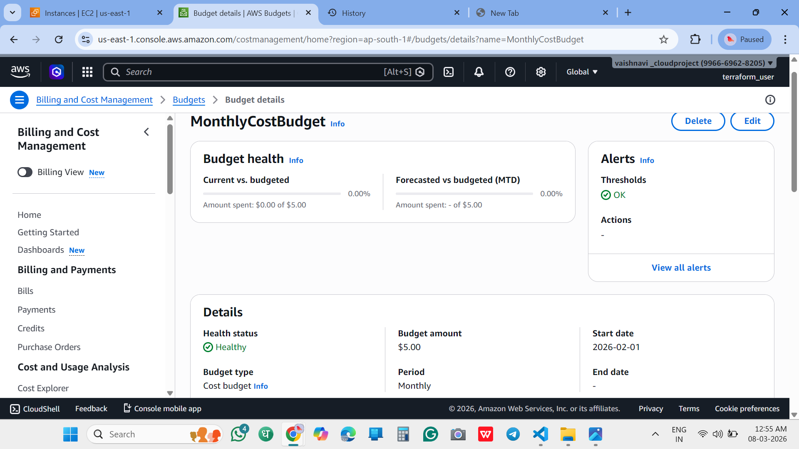

# Terraform EC2 Monitoring Project

## Project Overview
This project automates EC2 instance creation using Terraform and sets up monitoring and budget alerts.

## Tools Used
- AWS
- Terraform
- GitHub

## AWS Services Used
- EC2
- CloudWatch
- AWS Budgets

## How to Run
terraform init
terraform plan
terraform apply

## Screenshots
### EC2 Instance

### CloudWatch Alarm

### Budget Alert

### Terraform Apply

